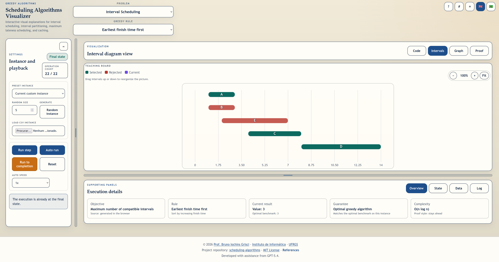

# scheduling-algorithms

<p align="right">
  <strong>English</strong> |
  <a href="README.pt-BR.md">Português (Brasil)</a>
</p>

**scheduling-algorithms** is an interactive, browser-based educational webtool for five greedy-algorithm teaching scenarios:

- **Interval Scheduling**
- **Interval Partitioning**
- **Scheduling to Minimize Maximum Lateness**
- **Optimal Caching**
- **Caching under Real Operating Conditions**

The tool was built for classroom use and makes the algorithmic decisions visible through synchronized **code**, **data structure**, **interval / cache**, **graph** (when applicable), and **proof** views.

It follows the project requirements in `instructions.md` and the technical references in `refs/`, especially Chapter 4 of *Algorithm Design* by Jon Kleinberg and Éva Tardos.

🔗 **GitHub Pages target:** https://brunogrisci.github.io/schedulingalgorithms  
🔗 **GitHub repository:** https://github.com/BrunoGrisci/scheduling-algorithms



---

## ✨ Features

### Core functionality
- Switch between all five supported problems from a single control panel.
- Choose among both **optimal** and **nonoptimal** greedy strategies so students can compare success and failure cases.
- Load **reference-backed presets** derived from *Algorithm Design* and classroom material.
- Generate **random instances** with configurable size or cache parameters.
- Import custom instances from **CSV**.
- Step through each execution with:
  - **Run step**
  - **Auto run**
  - **Run to completion**
  - configurable playback speeds from **0.25x** to **10x**

### Synchronized visualizations
- **Code view** with highlighted pseudocode line.
- **Data structure view** showing sorted items, conflicts, slack, current focus, and the evolving greedy solution.
- **Interval / cache view**:
  - compatible / rejected intervals for interval scheduling,
  - room allocation for interval partitioning,
  - scheduled jobs, deadlines, and lateness for maximum lateness.
  - cache contents, hits, misses, evictions, request progression, and a per-step eviction strip for the caching problems.
- **Graph view**:
  - conflict graph for interval problems,
  - inversion graph for maximum lateness.
  - optional node-area scaling proportional to interval length in conflict graphs.
  - optional time-axis mode that places conflict-graph nodes at `(s_i, f_i)` on equal start/finish time axes.
- No graph tab for caching problems, as required by the updated specification.
- **Proof view** for the three correct greedy algorithms:
  - **stays ahead** for earliest-finish-time-first interval scheduling,
  - **structural bound** for earliest-start-time-first interval partitioning,
  - **exchange argument** for earliest-deadline-first maximum lateness,
  - and a detailed exchange-style cache proof view for Farthest-in-Future.

### Usability & UI
- Projector-oriented layout with large typography and high-contrast visual states.
- **Light mode / dark mode** toggle.
- **English / Brazilian Portuguese** toggle.
- Fully collapsible and restorable **settings rail**.
- Teaching-board **zoom in / zoom out / fit** controls for interval and graph views.
- Direct manipulation on interval views:
  - drag intervals vertically in interval scheduling and interval partitioning,
  - drag jobs horizontally in maximum lateness, while deadline markers stay fixed at their times.
- Direct manipulation on free-layout conflict graphs:
  - drag nodes to reorganize the graph,
  - keep edges attached to their corresponding nodes,
  - automatically disable dragging in time-axis mode.
- In-page **help modal** and **references modal**.
- Fully client-side, with no backend or external framework.

---

## 📄 Input format

### Interval Scheduling / Interval Partitioning CSV
```csv
id,start,finish
A,0,3
B,2,5
```

### Scheduling to Minimize Lateness CSV
```csv
job,length,deadline
a,3,7
b,2,5
```

### Caching CSV
```csv
n_elements,cache_size,queue
6,3,A B A C D A B
```

Notes:
- The header row is optional.
- For interval problems, `finish` must be strictly greater than `start`.
- For lateness instances, `length` must be positive.
- For caching instances, `queue` is the request stream, separated by spaces.

---

## 🧠 Pedagogical goals

This tool was designed to help students:
- compare natural greedy rules that **fail** against those that are **provably optimal**,
- understand how sorting order changes the resulting solution,
- compare offline caching with full future knowledge against online caching under operating conditions,
- track the exact state of the greedy algorithm at each step,
- connect the implementation to the proof patterns used in the references,
- inspect the role of conflict counts, overlap depth, deadlines, slack, lateness, cache misses, and eviction policies.

It is suitable for:
- undergraduate algorithms courses,
- classroom demonstrations with a projector,
- guided exercises about greedy correctness arguments,
- self-study with interactive examples and CSV-based experimentation.

---

## 🌐 Internationalization (i18n)

- Full support for **English** and **Brazilian Portuguese**
- UI labels, help text, references, proof descriptions, and feedback messages are bilingual
- Switching language does **not** reset the current problem instance

---

## 🛠️ Tech stack

- Vanilla **HTML / CSS / JavaScript**
- ES modules
- No external UI framework
- Browser-hosted and compatible with **GitHub Pages**
- Lightweight Node-based verification via:
  ```bash
  npm test
  ```

---

## 🧪 Verification

The repository includes a small regression-style test file that checks:
- optimal interval scheduling on the reference instance,
- counterexamples for the nonoptimal greedy variants,
- optimal interval partitioning versus failing heuristics,
- maximum lateness examples from the lecture slides,
- optimal and heuristic caching behavior on book-derived request streams,
- CSV parsing for all supported input formats.

Browser validation was also used to confirm:
- theme toggle,
- language toggle,
- problem switching,
- settings rail collapse / restore,
- teaching-board zoom behavior,
- interval and job dragging,
- conflict-graph toggles for size scaling and time-axis placement,
- cache-step rendering and miss counters,
- proof tab rendering,
- auto-run behavior.

---

## 🚀 Future work (ideas)

- Add more reference-derived preset instances from additional slides and figures.
- Add editable table cells for direct in-browser instance editing.
- Add export to CSV for the current instance and solution.
- Add richer proof animations for the exchange and stays-ahead arguments.
- Add optional complexity overlays that show the active data structure and cache operations step by step.

---
## 🎓 Credits

**Developed by**  
**Prof. Bruno Iochins Grisci**  
Departamento de Informática Teórica  
Instituto de Informática – Universidade Federal do Rio Grande do Sul (UFRGS)  
🔗 https://brunogrisci.github.io/  
🔗 https://www.inf.ufrgs.br/site/  
🔗 https://www.ufrgs.br/site/

**Technical references used in this project**
- Jon Kleinberg and Éva Tardos, *Algorithm Design*, Chapter 4
- Classroom lecture material on greedy algorithms
- Princeton greedy demos for earliest-finish-time-first and earliest-start-time-first

**Development note**  
This webtool was created with the assistance of **Generative AI (GPT-5.4)**.

---
## 📦 License

This project is licensed under the **MIT License**.

You are free to use, modify, and redistribute it for academic and educational purposes, provided proper attribution is given.

See the `LICENSE` file for details.

---

If you use this tool in teaching or research, a citation or link back to the repository is appreciated.

## 📚 Citation

If you use this tool in academic work (papers, theses, technical reports, or teaching material), please cite it as:

```bibtex
@software{Grisci_scheduling_algorithms,
  author       = {Bruno Iochins Grisci},
  title        = {{scheduling-algorithms}: An Interactive Visualizer for Greedy Scheduling Algorithms},
  year         = {2026},
  url          = {https://github.com/BrunoGrisci/scheduling-algorithms},
  note         = {Educational web-based software},
}
```

---
## 🔄 See also

- **Projeto e Análise de Algoritmos**
  Repository: https://github.com/BrunoGrisci/projeto-e-analise-de-algoritmos
