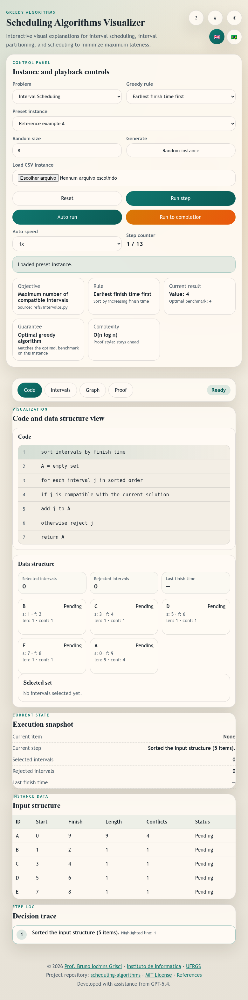

# scheduling-algorithms

<p align="right">
  <a href="README.md">English</a> |
  <strong>Português (Brasil)</strong>
</p>

**scheduling-algorithms** é uma ferramenta educacional interativa, executada no navegador, para cinco cenários didáticos de algoritmos gulosos:

- **Escalonamento de Intervalos**
- **Particionamento de Intervalos**
- **Escalonamento para Minimizar o Atraso Máximo**
- **Caching Ótimo**
- **Caching sob Condições Reais de Operação**

A ferramenta foi construída para uso em sala de aula e torna visíveis as decisões do algoritmo por meio de visualizações sincronizadas de **código**, **estrutura de dados**, **intervalos / cache**, **grafo** (quando aplicável) e **prova**.

Ela segue os requisitos do projeto em `instructions.md` e as referências técnicas em `refs/`, especialmente o Capítulo 4 de *Algorithm Design*, de Jon Kleinberg e Éva Tardos.

🔗 **Destino do GitHub Pages:** https://brunogrisci.github.io/scheduling-algorithms/  
🔗 **Repositório GitHub:** https://github.com/BrunoGrisci/scheduling-algorithms



---

## ✨ Funcionalidades

### Funcionalidade principal
- Alternância entre os cinco problemas suportados num único painel de controle.
- Escolha entre estratégias gulosas **ótimas** e **não ótimas**, para que estudantes comparem casos de sucesso e de falha.
- Carregamento de **instâncias predefinidas baseadas nas referências** do livro *Algorithm Design* e em material de aula.
- Geração de **instâncias aleatórias** com tamanho configurável ou parâmetros de cache.
- Importação de instâncias personalizadas via **CSV**.
- Execução passo a passo com:
  - **Executar passo**
  - **Execução automática**
  - **Executar até o final**
  - velocidades configuráveis de **0.25x** até **10x**

### Visualizações sincronizadas
- **Visualização de código** com destaque da linha de pseudocódigo atual.
- **Visualização da estrutura de dados** mostrando itens ordenados, conflitos, folga, foco atual e a solução gulosa em evolução.
- **Visualização de intervalos / cache**:
  - intervalos compatíveis / rejeitados para escalonamento de intervalos,
  - alocação em salas para particionamento,
  - tarefas escalonadas, deadlines e atrasos para atraso máximo.
  - conteúdo do cache, acertos, faltas, remoções e avanço das requisições nos problemas de caching.
- **Visualização em grafo**:
  - grafo de conflitos para problemas de intervalos,
  - grafo de inversões para atraso máximo.
- Sem aba de grafo para os problemas de cache, como exigido pela especificação atualizada.
- **Visualização das provas** para os três algoritmos corretos:
  - **fica à frente** para `TerminaMaisCedo`,
  - **limite estrutural** para `IniciaMaisCedo`,
  - **argumento da troca** para `MenorDeadlinePrimeiro`,
  - e uma visualização detalhada de prova por troca para `Farthest-in-Future`.

### Usabilidade e UI
- Layout voltado para projeção em sala, com tipografia grande e estados visuais contrastantes.
- Alternância entre **modo claro** e **modo escuro**.
- Alternância entre **Inglês** e **Português do Brasil**.
- **Painel lateral de configurações** totalmente colapsável e restaurável.
- Controles de **ampliar / reduzir / ajustar** no quadro didático para as visualizações de intervalos e grafo.
- Manipulação direta nas visualizações de intervalos:
  - arrastar intervalos verticalmente em escalonamento de intervalos e particionamento,
  - arrastar jobs horizontalmente em atraso máximo, enquanto os marcadores de deadline permanecem fixos nos seus tempos.
- **Modal de ajuda** e **modal de referências** dentro da própria página.
- Totalmente no cliente, sem backend e sem framework externo.

---

## 📄 Formato de entrada

### CSV para Escalonamento de Intervalos / Particionamento de Intervalos
```csv
id,start,finish
A,0,3
B,2,5
```

### CSV para Minimização de Atraso
```csv
job,length,deadline
a,3,7
b,2,5
```

### CSV para Caching
```csv
n_elements,cache_size,queue
6,3,A B A C D A B
```

Observações:
- A linha de cabeçalho é opcional.
- Para problemas com intervalos, `finish` deve ser estritamente maior que `start`.
- Para instâncias de atraso, `length` deve ser positivo.
- Para instâncias de cache, `queue` é a sequência de requisições separada por espaços.

---

## 🧠 Objetivos pedagógicos

Esta ferramenta foi projetada para ajudar estudantes a:
- comparar regras gulosas naturais que **falham** com aquelas que são **comprovadamente ótimas**,
- entender como a ordem de classificação altera a solução produzida,
- comparar caching offline com conhecimento completo do futuro e caching online sob condições reais de operação,
- acompanhar o estado exato do algoritmo guloso em cada passo,
- conectar a implementação aos estilos de prova usados nas referências,
- inspecionar o papel de contagem de conflitos, profundidade de sobreposição, deadlines, folga, atraso, faltas de cache e políticas de remoção.

Ela é adequada para:
- disciplinas de graduação em algoritmos,
- demonstrações em sala com projetor,
- exercícios guiados sobre provas de corretude para algoritmos gulosos,
- estudo individual com exemplos interativos e experimentos via CSV.

---

## 🌐 Internacionalização (i18n)

- Suporte completo para **Inglês** e **Português do Brasil**
- Rótulos de UI, ajuda, referências, descrições das provas e mensagens de feedback são bilíngues
- Trocar o idioma **não** reinicia a instância atual

---

## 🛠️ Stack tecnológica

- **HTML / CSS / JavaScript** puro
- Módulos ES
- Sem framework externo de UI
- Hospedagem compatível com **GitHub Pages**
- Verificação leve via Node com:
  ```bash
  npm test
  ```

---

## 🧪 Verificação

O repositório inclui um pequeno arquivo de regressão que verifica:
- o escalonamento ótimo de intervalos na instância de referência,
- contraexemplos para as variantes gulosas não ótimas,
- o particionamento ótimo de intervalos versus heurísticas que falham,
- exemplos de atraso máximo vindos dos slides,
- o comportamento ótimo e heurístico do caching em sequências derivadas do livro,
- parsing de CSV para todos os formatos de entrada suportados.

Também foi usada validação no navegador para confirmar:
- alternância de tema,
- alternância de idioma,
- troca de problema,
- colapso e restauração do painel lateral,
- comportamento do zoom no quadro didático,
- arraste de intervalos e jobs,
- renderização passo a passo do cache e do contador de faltas,
- renderização da aba de provas,
- comportamento da execução automática.

---

## 🚀 Trabalhos futuros (ideias)

- Adicionar mais instâncias predefinidas derivadas diretamente de slides e figuras das referências.
- Adicionar células editáveis na tabela para edição direta no navegador.
- Adicionar exportação para CSV da instância atual e da solução.
- Adicionar animações mais ricas para as provas por troca e por ficar à frente.
- Adicionar sobreposições opcionais de complexidade mostrando as operações da estrutura de dados e do cache passo a passo.

---
## 🎓 Créditos

**Desenvolvido por**  
**Prof. Bruno Iochins Grisci**  
Departamento de Informática Teórica  
Instituto de Informática – Universidade Federal do Rio Grande do Sul (UFRGS)  
🔗 https://brunogrisci.github.io/  
🔗 https://www.inf.ufrgs.br/site/  
🔗 https://www.ufrgs.br/site/

**Referências técnicas usadas neste projeto**
- Jon Kleinberg e Éva Tardos, *Algorithm Design*, Capítulo 4
- Material de aula sobre algoritmos gulosos
- Demos de Princeton para `earliest-finish-time-first` e `earliest-start-time-first`

**Nota de desenvolvimento**  
Esta ferramenta foi criada com a assistência de **IA Generativa (GPT-5.4)**.

---
## 📦 Licença

Este projeto está licenciado sob a **Licença MIT**.

Você pode usar, modificar e redistribuir para fins acadêmicos e educacionais, desde que haja a devida atribuição.

Veja o arquivo `LICENSE` para detalhes.

---

Se você usar esta ferramenta em ensino ou pesquisa, uma citação ou link para o repositório é bem-vindo.

## 📚 Citação

Se você usar esta ferramenta em trabalhos acadêmicos (artigos, teses, relatórios técnicos ou material didático), cite-a como:

```bibtex
@software{Grisci_scheduling_algorithms,
  author       = {Bruno Iochins Grisci},
  title        = {{scheduling-algorithms}: Um Visualizador Interativo para Algoritmos Gulosos de Escalonamento},
  year         = {2026},
  url          = {https://github.com/BrunoGrisci/scheduling-algorithms},
  note         = {Software educacional baseado na web},
}
```

---
## 🔄 Veja também

- **Projeto e Análise de Algoritmos**
  Repositório: https://github.com/BrunoGrisci/projeto-e-analise-de-algoritmos
